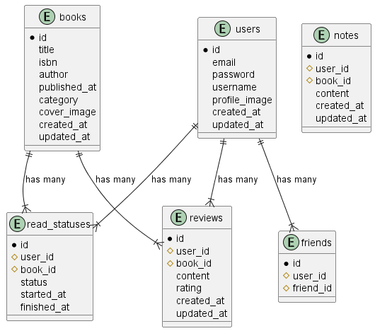

# BookTracker

[概要](https://butter-epoch-8f2.notion.site/booktracker-eb0c7435171c4e82b9460f067fe6cbda?pvs=4)
[設計書](https://butter-epoch-8f2.notion.site/BookTracker-fecb4769c1254e01a178bbc0f603cea5?pvs=4)


## 環境構築


## PlantUMLの設定
データベースのUMLを記述するために、PlantUMLを使用する。

- javaをインストール

```
$ choco install plantuml
```

graphvizにpathを通す。


### app(バックエンド側)

```bash
$ docker build myimage ./app
$ docker run -p 80:80 myimage
```

Dockerのコンテナに接続するには、`Dev Containers`の拡張機能を使う。

Dockerコンテナを起動した状態で、
`Dev Containers: Attach to Running Container..`を選択する。

ホストマシンとファイルを同期するために、
`docker-compose.yml`にvolumesの指定をする。

```yaml
app:
  ...
  volumes:
    ./app:/usr/src/app # hostとcontainerのファイルの同期
  ...
```


#### データベース設計 




### front(フロント側)

```bash
$ npm create vue@latest
```

vite.config.js
```js
export default defineConfig({
    server: {
        host: "0.0.0.0", # ポートフォワーディングの設定
        watch: {
            usePolling: true # hot reloadの設定
        }
    }
})    
```

Dockerfile
```
FROM --platform=$BUILDPLATFORM node:20-alpine AS development

RUN mkdir /project
WORKDIR /project

COPY . .

RUN npm install -g @vue/cli
RUN npm install
ENV HOST=0.0.0.0
CMD ["npm", "run", "dev"]
```

```bash
$ docker build -t vuejs .
$ docker run -p 3000:5173 vuejs
```

これでホストマシンのlocalhost:3000でアクセスできる。

### docker composeでの構築

```bash
$ docker compose up -d
```

フロントエンド: port 3000  
バックエンド: port 80  

以上で環境構築が完了。

各コンテナの中に入りたい場合は、
```bash
$ docker compose exec web sh
```


## JWT認証

[公式ドキュメント](https://fastapi.tiangolo.com/ja/tutorial/security/oauth2-jwt/#_3)を参照。

#### CryptContextオブジェクトを作成する
```python
from passlib.context import CryptContext
pwd_context = CryptContext(schemes=["bcrypt"], deprecated="auto")
```

#### OAuth2Passwordの関数オブジェクトを作成する
```python
from fastapi.security import OAuth2PasswordBearer, OAuth2PasswordRequestForm

oauth2_scheme = OAuth2PasswordBearer(tokenUrl="token")
```


#### tokenへのポストでtokenを生成する


```python
@app.post("/token")
async def login_for_access_token(form_data: Annotated[OAuth2PasswordRequestForm, Depends()],) -> Token:
  pass

```

